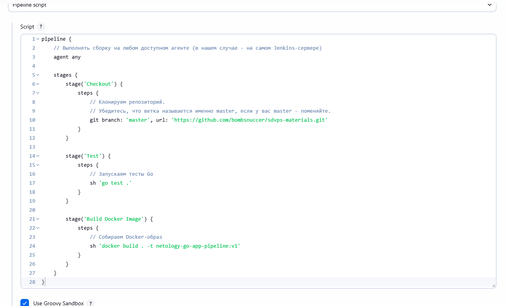
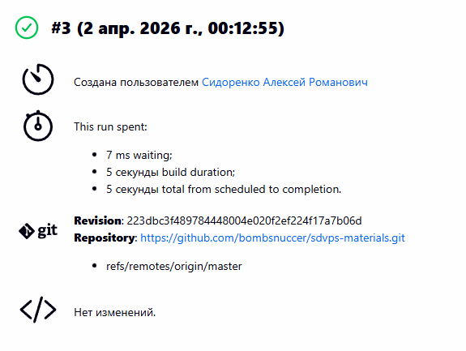
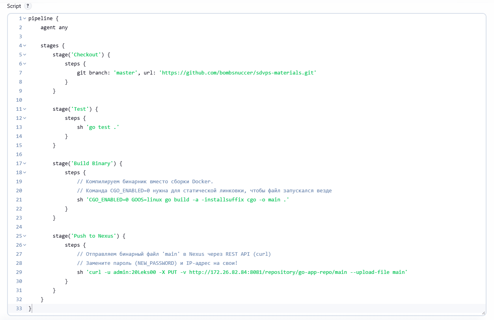
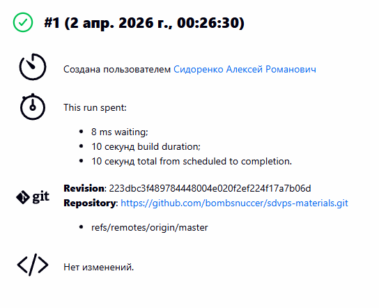
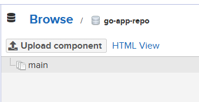

# Домашнее задание к занятию "`Что такое DevOps. CI/CD`" - `Сидоренко Алексей`

### Задание 1

В качестве ответа пришлите скриншоты с настройками проекта и результатами выполнения сборки.

Скриншот настроек проекта:

Скриншот успешного выполнения сборки:

---

### Задание 2

Скриншот настроек проекта:

Скриншот успешного выполнения сборки:

---

### Задание 3

Скриншот настроек проекта:

Скриншот успешного выполнения сборки:

Скриншот репозитория Nexus с артефактом:

